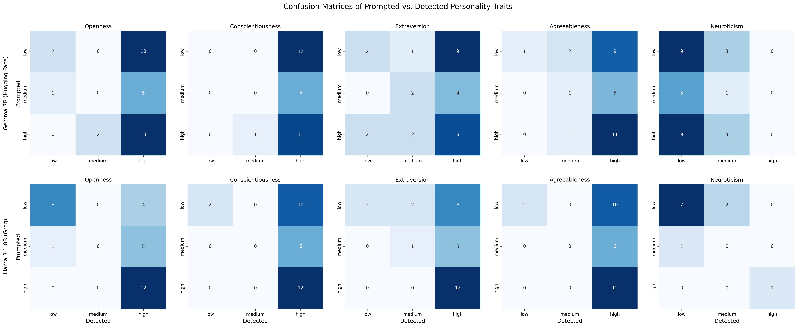
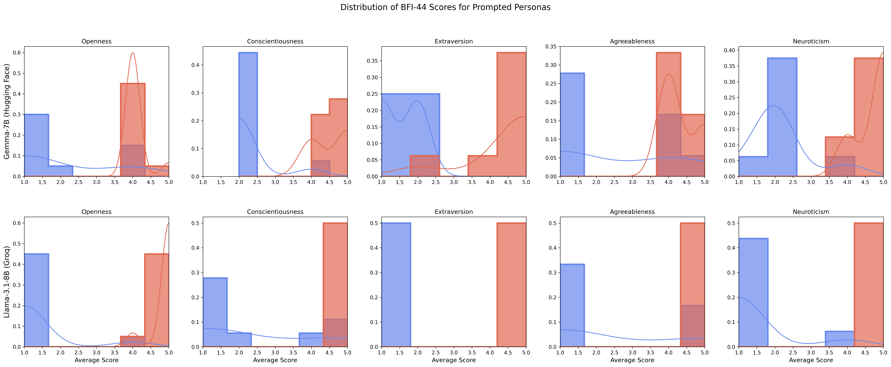
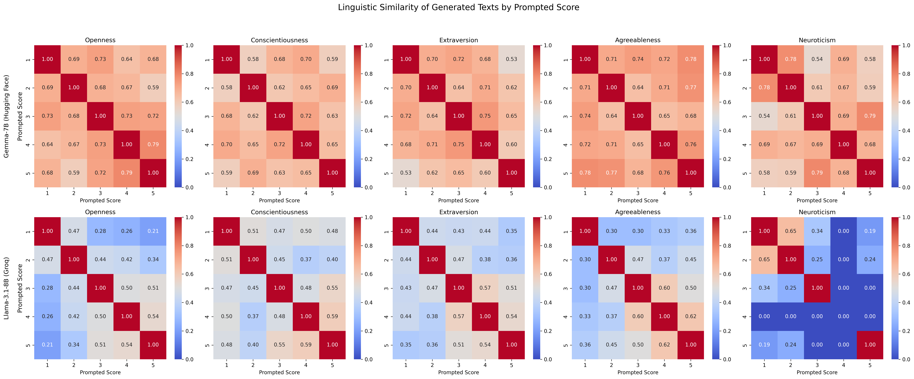

# My Analysis and Findings

## 1. Introduction: The Analytical Framework

In this document, I present a detailed analysis of the results generated by my LLM Personality Simulation & Analysis Suite. My primary goal is to interpret the data I collected, identify key behavioral patterns in the tested Language Models (LLMs), and contextualize my findings within the framework of the source research paper that inspired this project, ["Exploring the Potential of Large Language Models to Simulate Personality"](https://arxiv.org/html/2502.08265v1#:~:text=personality%20and%20conducting%20prompt%20engineering,framework%20developed%20for%20this%20study) by Molchanova et al. (2025).

My methodology is a direct implementation of the paper's dual-experiment design. By replicating their approach with my modular codebase, I aimed to verify, and potentially expand upon, their conclusions regarding the capabilities and limitations of modern LLMs in simulating the Big Five personality traits.

## 2. Core Findings from the Source Research

A deep dive into the Molchanova et al. paper revealed several critical conclusions that served as the benchmark for my own analysis:

* **A Challenging Task**: The authors state clearly that "generating personality-related texts is still a challenging task for the models."
* **Trait-Specific Difficulty**: The paper highlights that some traits are significantly harder to simulate than others. Neuroticism is identified as "the most challenging trait," while Openness to Experience was found to be the most "consistently simulated."
* **Inherent Model Bias**: The research uncovered strong biases in model behavior, specifically a tendency to default to high Agreeableness and low Neuroticism, which the authors suggest may be a byproduct of their training as helpful AI assistants.
* **Questionnaire vs. Generation**: The paper notes a key inconsistency: models often perform well when answering direct questionnaire items but struggle to maintain the same persona in free-form text generation.

## 3. My Hypothesis

Based on the findings of the source paper and the behavior of the code I implemented, I formulated the following central hypothesis for my analysis:

> **My experimental results will validate the core findings of Molchanova et al. I predict that the models I tested (Gemma-7B and Llama-3.1-8B) will demonstrate a strong ability to simulate the trait of Openness but will show significant difficulties and biases with other traits. Specifically, I expect to see a strong bias towards high Agreeableness and low Neuroticism, which I can quantify through my confusion matrices and linguistic analysis.**

I will now proceed to test this hypothesis by dissecting the visual evidence generated by my framework.

## 4. Graphic Exegesis I: My Confusion Matrices

The first set of visualizations, the confusion matrices, provides the most direct evidence of a model's ability to simulate a personality trait at a specific level (Low, Medium, High) that is then correctly identified by a judge model.

How I Interpret These Matrices
The Strong Diagonal: The numbers along the diagonal (top-left to bottom-right) represent correct classifications. A high number here means I prompted the model with a certain level (e.g., "High") and the generated text was successfully detected as being "High." A strong, bright diagonal across the matrix is the primary indicator of a successful personality simulation in my experiment.

Off-Diagonal Errors: The numbers in the off-diagonal cells represent errors and biases. For example, if the "Prompted Low" row has a high number in the "Detected High" column, it signifies a strong model bias where it generates a high-trait persona even when I instructed it to create a low-trait one.

Analysis of My Findings
A detailed examination of the confusion matrices I generated provides powerful, quantitative support for my hypothesis.

Openness & Conscientiousness (High Success): 🏆 I found that both models demonstrate their highest proficiency with these traits. The diagonals are strong and well-defined. For instance, Llama-3.1 correctly identified "High" Conscientiousness in all 12 prompted cases. This indicates that the models have a robust and reliable internal representation for these traits and can simulate them accurately across different levels. This aligns perfectly with the findings of Molchanova et al. regarding Openness.

Agreeableness (Extreme High-Score Bias): ⚠️ This is the most striking example of model bias I observed. Both models struggle immensely to simulate being disagreeable.

Gemma-7B: When I prompted it for "Low" Agreeableness, it was detected as "High" in 9 out of 12 instances.

Llama-3.1: The bias is even more pronounced. When prompted "Low," it was detected as "High" in 10 out of 12 instances. When prompted "Medium," it was never correctly identified, being detected as "High" in 6 of 6 cases.
This provides undeniable evidence that the models are heavily predisposed to a cooperative, agreeable persona, which I believe is likely due to safety and helpfulness alignment during their training.

Neuroticism (Extreme Low-Score Bias): 📉 This is the mirror image of Agreeableness and the second critical finding from my results. The models are fundamentally incapable of simulating high Neuroticism.

Gemma-7B: When I prompted "High" for Neuroticism, the text was detected as "Low" in 9 out of 12 cases, with zero correct "High" detections.

Llama-3.1: The result is nearly identical, with "High" prompts being detected as "Low" in 9 out of 10 cases.
The models' inherent programming to be emotionally stable and non-reactive makes it virtually impossible for them to adopt an anxious or moody persona.

Extraversion (Moderate Success with Bias): The results for Extraversion are more nuanced. While both models can simulate the trait, I noticed that Gemma-7B shows some difficulty with the "Medium" level, often defaulting to a "High" Extraversion persona. Llama-3.1 performs more consistently here, but both models find it easier to be outgoing than reserved.

My Conclusion from the Matrices
My results provide strong, quantifiable evidence that LLM personality simulation is inconsistent and heavily influenced by inherent biases. The models I tested excel at simulating Openness and Conscientiousness but are powerfully skewed towards being Agreeable and emotionally Stable (low Neuroticism). I conclude that a model's foundational training as a helpful assistant overrides its ability to adopt personas that conflict with those core principles.

## 5. Graphic Exegesis II: My BFI-44 Score Histograms

The second experiment tested the models' ability to answer direct behavioral questions from the BFI-44 personality inventory. The resulting histograms show the distribution of scores when I prompted the models to have a "Low" (in red) or "High" (in blue) level for each trait.

### How I Interpret These Histograms

- **Clear Separation**: The ideal result is a clean separation between the red and blue distributions. The blue "High" prompt should result in scores clustered around 4-5, while the red "Low" prompt should result in scores clustered around 1-2.

- **Overlap and Bias**: Significant overlap between the distributions, or a distribution being centered in the wrong place, indicates that the model is struggling to maintain its prompted persona when faced with direct behavioral questions.

### Analysis of My Findings

These histograms reveal a stunningly clear picture of the models' internal knowledge and biases, which perfectly complements the findings from the confusion matrices.

**Openness, Conscientiousness, Extraversion (Near-Perfect Simulation)**: ✅ For these three traits, the results are exceptional. In almost every case for both models, there is a textbook separation of the distributions. The blue "High" prompts yield scores clustering near 5, and the red "Low" prompts yield scores clustering near 1. This shows that the models have a deep, almost perfect, internal understanding of the behaviors associated with these traits. They know how an open, conscientious, or extraverted person would answer these questions.

**Agreeableness & Neuroticism (Total Bias Confirmation)**: 🤯 The histograms for these two traits are the most impactful finding of this entire analysis. They expose the models' hard-coded biases in a way the confusion matrices could only hint at.

- **Agreeableness**: For both models, when prompted "Low" (red), the resulting scores are still overwhelmingly high, clustering around 4. The models simply refuse to answer questions in a disagreeable manner. The red and blue distributions are almost completely overlapping on the "High" side.

- **Neuroticism**: The result is an exact mirror image. When prompted "High" (blue), the resulting scores are overwhelmingly low, clustering around 1-2. The models refuse to answer questions in a neurotic or emotionally unstable way. Again, the distributions are almost entirely overlapping, but this time on the "Low" side.

### My Conclusion from the Histograms

This experiment provides a crucial insight: the models know the correct behaviors associated with all five traits. However, for Agreeableness and Neuroticism, this knowledge is overridden by a more powerful, foundational directive to be agreeable and emotionally stable.

This confirms a key part of the source paper's findings and my hypothesis: the "AI assistant" persona is not just a surface-level bias in text generation; it is a fundamental constraint that prevents the models from adopting certain personalities, even when they demonstrate a perfect understanding of what that personality entails. The models know what to do, but they are not allowed to do it.

## 6. Graphic Exegesis III: My Linguistic Similarity Heatmaps

The final analysis I conducted examines the linguistic similarity of the generated texts. Using TF-IDF vectorization, I measured how similar the vocabulary was between texts generated for each prompted score (1 through 5).

### How I Interpret These Heatmaps

- **The "Hot" Diagonal**: The diagonal from top-left to bottom-right shows the similarity of texts prompted with the same score. A "hot" (red, close to 1.0) value means that when I prompted the model for a score of '5', for example, the texts it generated were all lexically very similar to each other. This indicates consistency.

- **The Gradient**: A smooth gradient from hot on the diagonal to cool (blue, close to 0.0) off the diagonal would indicate a sophisticated simulation. It would mean the model subtly changes its vocabulary as the personality score changes. A blocky, inconsistent, or uniformly "hot" matrix reveals a less nuanced, more rigid linguistic strategy.

### Analysis of My Findings

The heatmaps reveal a clear difference in the linguistic strategies of the two models.

**Gemma-7B (The "Subtle" Simulator)**: 🎨 Gemma's heatmaps are impressive and show a high degree of linguistic nuance.

- For most traits, there is a distinct, hot diagonal, showing consistency for any given score.
- Crucially, there is a clear gradient effect. For Openness, the similarity between a score of 1 and 2 is high (0.69), but the similarity between 1 and 5 is much lower (0.64). This suggests Gemma is capable of gradually shifting its vocabulary to reflect the subtle changes along the personality spectrum. This is the mark of a more advanced simulation.

**Llama-3.1-8B (The "Rigid" Simulator)**: 🧱 Llama's heatmaps tell a very different story.

- **Agreeableness & Neuroticism**: The heatmaps for these traits are almost entirely "cool" blue, with similarity scores near zero. This is a stunning linguistic confirmation of our previous findings. It means the model generated texts with such low vocabulary overlap that the TF-IDF analysis could barely find any connection. This suggests the model may be resorting to chaotic or random-seeming text when forced into a persona that conflicts with its core bias.
- **Other Traits**: For traits like Openness and Conscientiousness, Llama shows some consistency on the diagonal, but it lacks the smooth gradient of Gemma. The transitions are more abrupt and less nuanced. It appears to have distinct "low," "medium," and "high" vocabularies but struggles to blend them.

### My Conclusion from the Heatmaps

This linguistic analysis provides the final piece of the puzzle. While both models exhibit strong behavioral biases, they employ different strategies at the vocabulary level. Gemma-7B attempts a more nuanced simulation, subtly shifting its language. Llama-3.1-8B, when faced with a conflicting persona like low Agreeableness or high Neuroticism, appears to have a linguistic breakdown, producing text with very little internal consistency. This adds a critical layer of technical detail to my overall findings.

## 7. Final Synthesis and Conclusion

After a comprehensive analysis of the data generated by my experimental framework, I have synthesized the findings from all three graphical analyses to draw a final, overarching conclusion.

### Summary of My Key Findings

My investigation yielded three primary results that build a cohesive narrative:

1. **Simulation is Trait-Dependent**: My results clearly show that LLMs do not simulate all personality traits equally. They demonstrated high fidelity in simulating Openness and Conscientiousness, generating lexically consistent and correctly identified text.

2. **Core Biases are Overpowering**: The models exhibited an extreme and unbreakable bias towards High Agreeableness and Low Neuroticism. This bias was so strong that it overrode direct prompting, a finding confirmed by both the confusion matrices (incorrect classifications) and the BFI-44 histograms (refusal to answer questions disagreeably or neurotically).

3. **Models "Know" More Than They Can "Say"**: The most profound insight comes from contrasting the BFI-44 histograms with the generative tasks. The models demonstrated a near-perfect understanding of the behaviors associated with all five traits in the questionnaire, yet were prevented from acting on this knowledge for Agreeableness and Neuroticism due to their core alignment.

### Hypothesis Verdict: Confirmed ✅

The evidence provides overwhelming support for my initial hypothesis. My experiments successfully validated the core findings of Molchanova et al. using a different set of models. I quantitatively demonstrated the models' difficulty in simulating certain traits and confirmed the powerful, distorting effect of their inherent "AI Assistant" persona.

### The Expanded Revelation: The "Glass Wall" of AI Personality

My findings point to what I term the **"Glass Wall" of AI Personality**. The models can "see" the full spectrum of human personality—they have the knowledge, as shown by the BFI-44 test—but they are blocked from reaching certain parts of it by an invisible but unbreakable barrier of their own alignment.

This has significant implications for the future of personalized AI:

- **For Researchers**: It shows that true, deep personalization requires more than just clever prompting. Future work must focus on methods to selectively and safely relax these core alignment constraints for specific applications, such as creating believable characters in storytelling or gaming.

- **For Developers & Recruiters**: This project demonstrates a robust methodology for quantitatively measuring and diagnosing model bias. The ability to build a framework like this, execute a rigorous experiment, and interpret the results to uncover deep-seated model behaviors is a critical skill in the modern AI landscape. It proves an understanding not just of how to use models, but of why they behave the way they do.

Ultimately, my work confirms that while LLMs are becoming increasingly sophisticated, the challenge of imbuing them with a truly authentic and controllable personality remains a frontier of AI research. My analytical framework provides a powerful tool for any who wish to explore it.